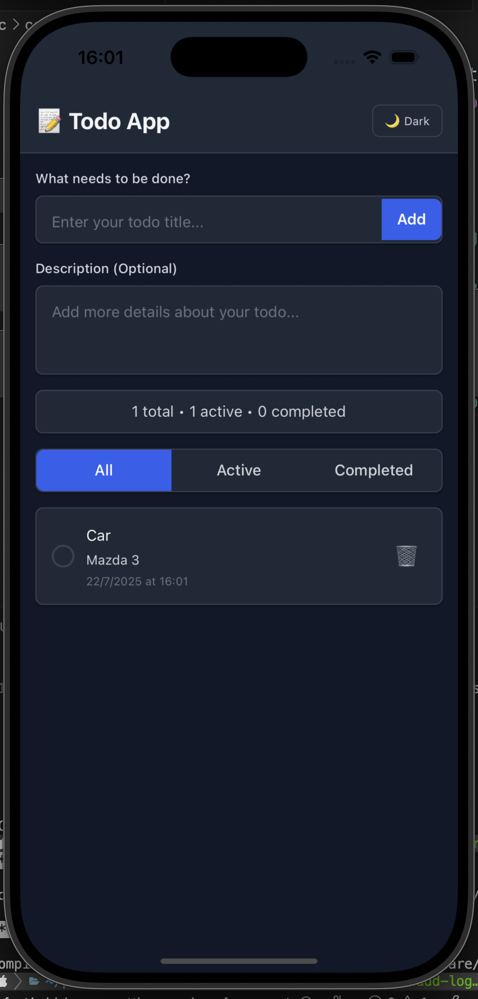

# 📝 React Native Todo App



A modern, feature-rich todo application built with React Native, Expo, and Zustand for state management. Designed specifically for iOS with a clean, intuitive interface.

## ✨ Features

- ➕ **Add Todos** - Create new tasks with a simple input interface
- ✅ **Toggle Completion** - Mark todos as complete/incomplete with a tap
- 🗑️ **Delete Todos** - Remove individual todos with confirmation alerts
- 🔍 **Filter Todos** - View All, Active, or Completed todos
- 📊 **Statistics** - Real-time count of total, active, and completed todos
- 🧹 **Bulk Actions** - Clear all completed todos at once
- ⏰ **Timestamps** - See when each todo was created
- 📱 **iOS Optimized** - Native iOS alerts and keyboard handling
- 🎨 **Modern UI** - Clean design with NativeWind/Tailwind CSS

## 🛠️ Tech Stack

- **React Native** - Cross-platform mobile development
- **Expo** - Development platform and tooling
- **TypeScript** - Type safety and better developer experience
- **Zustand** - Lightweight state management
- **NativeWind** - Tailwind CSS for React Native
- **Expo Router** - File-based routing

## 🏗️ Architecture

The app follows a clean architecture pattern with:

- **Components** - Pure UI components in `/src/app/`
- **State Management** - Centralized store with Zustand in `/src/store/`
- **TypeScript** - Full type safety throughout the application

### State Management with Zustand

The app uses Zustand for efficient, lightweight state management:

```typescript
// Store actions
const {
  todos,
  filter,
  inputText,
  addTodo,
  toggleTodo,
  deleteTodo,
  clearCompleted,
  setFilter,
  setInputText,
  getFilteredTodos,
  getStats,
} = useTodoStore();
```

## 🚀 Getting Started

### Prerequisites

- Node.js (v16 or higher)
- npm or yarn
- iOS Simulator (for iOS development)
- Expo CLI

### Installation

1. **Clone the repository**

   ```bash
   git clone <repository-url>
   cd react-native-todo
   ```

2. **Install dependencies**

   ```bash
   npm install
   ```

3. **Start the development server**

   ```bash
   npm start
   ```

4. **Run on iOS**

   ```bash
   npm run ios
   ```

## 📱 Usage

### Adding Todos

1. Type your task in the input field
2. Tap "Add" or press Enter to create the todo

### Managing Todos

- **Complete**: Tap the circle next to a todo to mark it as complete
- **Delete**: Tap the trash icon to delete a todo (with confirmation)
- **Filter**: Use the All/Active/Completed buttons to filter your view

### Bulk Actions

- **Clear Completed**: Remove all completed todos at once (with confirmation)

## 📂 Project Structure

```
src/
├── app/
│   ├── _layout.tsx          # App layout and navigation
│   └── index.tsx            # Main todo app component
├── store/
│   └── todoStore.ts         # Zustand store for state management
└── global.css               # Global styles
```

## 🧪 Available Scripts

- `npm start` - Start the Expo development server
- `npm run ios` - Run on iOS simulator
- `npm run android` - Run on Android emulator
- `npm run web` - Run on web browser

## 🔧 Configuration

### Metro Config

The app uses a custom Metro configuration for NativeWind:

```javascript
const { getDefaultConfig } = require("expo/metro-config");
const { withNativeWind } = require("nativewind/metro");

const config = getDefaultConfig(__dirname);
module.exports = withNativeWind(config, { input: "./src/global.css" });
```

### Tailwind Config

Tailwind is configured for React Native with custom content paths:

```javascript
module.exports = {
  content: ["./src/app/**/*.{js,jsx,ts,tsx}"],
  presets: [require("nativewind/preset")],
  theme: {
    extend: {},
  },
  plugins: [],
};
```

## 🎨 Styling

The app uses NativeWind for styling, which provides:

- Tailwind CSS utility classes for React Native
- Consistent design system
- Responsive design capabilities
- Easy theming and customization

## 📦 Dependencies

### Core Dependencies

- `react-native` - Mobile app framework
- `expo` - Development platform
- `expo-router` - File-based routing
- `zustand` - State management
- `nativewind` - Styling
- `react-native-safe-area-context` - Safe area handling

### Development Dependencies

- `typescript` - Type checking
- `@types/react` - React type definitions
- `tailwindcss` - CSS framework

## 🤝 Contributing

1. Fork the repository
2. Create a feature branch (`git checkout -b feature/amazing-feature`)
3. Commit your changes (`git commit -m 'Add some amazing feature'`)
4. Push to the branch (`git push origin feature/amazing-feature`)
5. Open a Pull Request

## 📄 License

This project is licensed under the MIT License - see the LICENSE file for details.

## 🙏 Acknowledgments

- Expo team for the excellent development platform
- Zustand for lightweight state management
- NativeWind for bringing Tailwind CSS to React Native

---

Built with ❤️ using React Native and Expo
